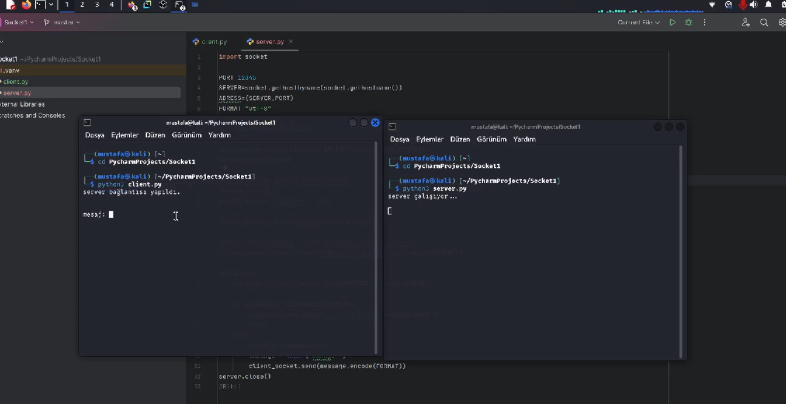
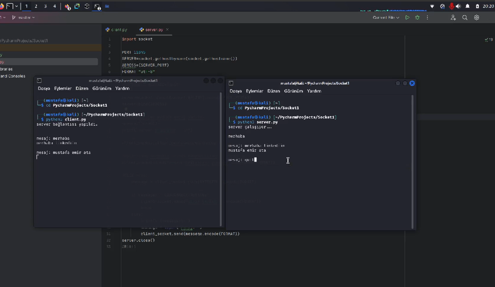

# 🔌 Basit Socket Tabanlı Sohbet Uygulaması  

Bu proje, Python'un `socket` modülünü kullanarak bir **Sunucu - İstemci** (Server - Client) haberleşme uygulaması oluşturur.  
Kullanıcılar, sunucuya bağlanarak mesaj gönderebilir ve alabilirler.

---

## 📌 Özellikler  
✅ Sunucu, gelen istemci bağlantılarını kabul eder.  
✅ İstemci, sunucuya bağlanarak mesaj alışverişi yapar.  
✅ **quit** yazıldığında bağlantı otomatik olarak kapanır.  

---

## 📁 Proje Dosyaları  
- **`server.py`** → Sunucu kodlarını içerir.  
- **`client.py`** → İstemci kodlarını içerir.  
- **`baglanti.png`** → Bağlantı örneği ekran görüntüsü.  
- **`mesajlar.png`** → Mesajlaşma ekran görüntüsü.  
- **`quit.png`** → Çıkış işlemi ekran görüntüsü.  

---

## 📷 Görseller  

### **1️⃣ Bağlantı Kurulması**  
Sunucu ve istemci arasında bağlantı başarıyla kurulduğunda:  
  

### **2️⃣ Mesajlaşma**  
Sunucu ve istemci arasında mesajlaşma:  
  

### **3️⃣ Çıkış Yapma**  
`quit` komutu girildiğinde bağlantı kapanır:  
  

---

## 🚀 Kurulum & Kullanım  

### 1️⃣ **Gerekli Modülleri Yükleyin**  
Python'da ekstra bir kütüphane gerekmez, `socket` modülü Python ile birlikte gelir.  

### 2️⃣ **Sunucuyu Başlatın**  
Önce server dosyasını çalıştırın, daha sonra client dosyasını çalıştırın:  
```sh
python server.py
python client.py
